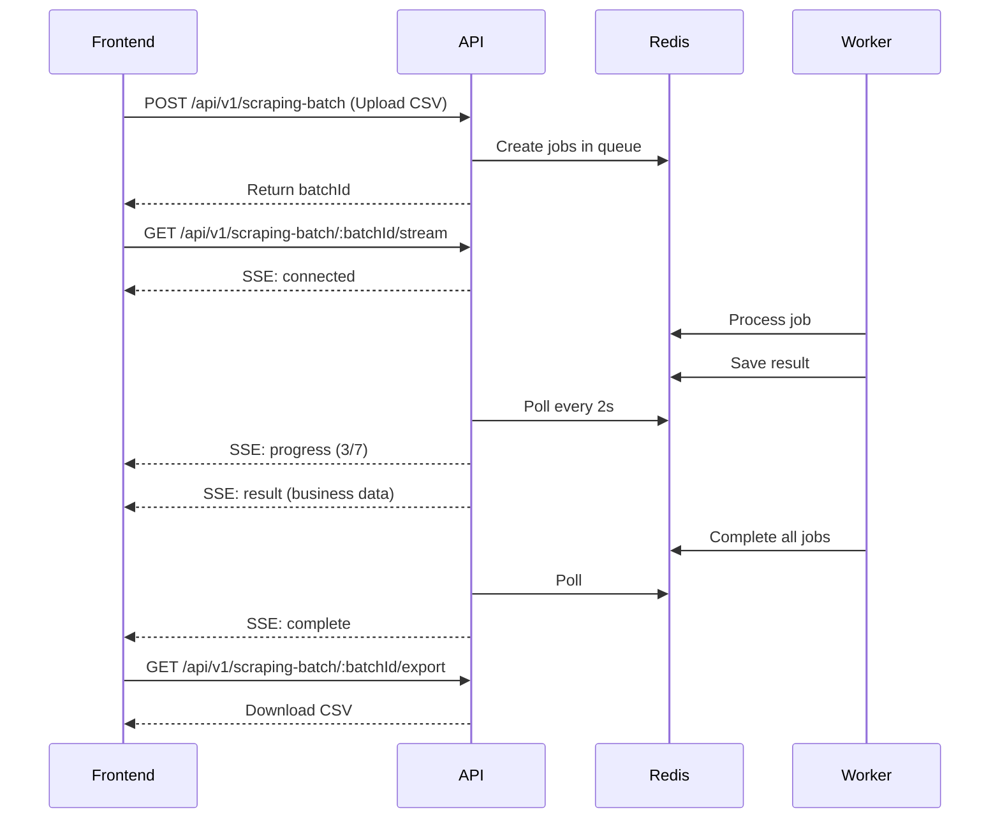

# 📡 Real-Time Streaming API Documentation

## Overview

The scraper now supports **real-time progress updates** using **Server-Sent Events (SSE)**. This allows your frontend to display live scraping progress without polling.

---

## 🎯 Backend Implementation

### New Endpoint

```
GET /api/v1/scraping-batch/:batchId/stream
```

**Description:** Opens a persistent connection to receive real-time updates as scraping jobs complete.

**Response Type:** `text/event-stream` (Server-Sent Events)

**CORS:** Enabled with `Access-Control-Allow-Origin: *`

---

## 📊 SSE Events

The endpoint emits the following event types:

### 1. `connected` Event
Sent immediately when client connects.

```json
{
  "batchId": "abc-123-def",
  "message": "Connected to real-time updates",
  "timestamp": "2025-10-21T13:30:00.000Z"
}
```

### 2. `progress` Event
Sent every 2 seconds with overall batch progress.

```json
{
  "batchId": "abc-123-def",
  "completed": 3,
  "total": 7,
  "percentage": 43,
  "timestamp": "2025-10-21T13:30:02.000Z"
}
```

### 3. `result` Event
Sent for each individual business result as it completes.

```json
{
  "index": 0,
  "name": "Apple Glattzentrum",
  "rating": "",
  "reviewsCount": "44",
  "phone": "+41 44 832 81 00",
  "address": "Einkaufszentrum Glatt, Neue Winterthurerstrasse 99, 8304 Wallisellen",
  "website": "https://www.apple.com/chde/retail/glattzentrum",
  "category": "Electronics store",
  "latitude": "47.4079832",
  "longitude": "8.5960423",
  "mondayHours": "09:00 - 20:00",
  "tuesdayHours": "09:00 - 20:00",
  "wednesdayHours": "09:00 - 20:00",
  "thursdayHours": "09:00 - 20:00",
  "fridayHours": "09:00 - 20:00",
  "saturdayHours": "09:00 - 20:00",
  "sundayHours": "Closed",
  "status": "success",
  "timestamp": "2025-10-21T13:30:02.500Z"
}
```

### 4. `complete` Event
Sent when all jobs are finished.

```json
{
  "batchId": "abc-123-def",
  "completed": 7,
  "total": 7,
  "message": "All jobs completed",
  "timestamp": "2025-10-21T13:32:00.000Z"
}
```

### 5. `error` Event
Sent if an error occurs during streaming.

```json
{
  "message": "Error fetching updates",
  "error": "Redis connection failed"
}
```

---

## 🖥️ Frontend Implementation Examples

### 1. Vanilla JavaScript (Browser)

```html
<!DOCTYPE html>
<html>
<head>
  <title>Real-Time Scraper Progress</title>
  <style>
    .progress-bar {
      width: 100%;
      height: 30px;
      background: #e0e0e0;
      border-radius: 5px;
      overflow: hidden;
    }
    .progress-fill {
      height: 100%;
      background: linear-gradient(90deg, #4CAF50, #8BC34A);
      transition: width 0.3s ease;
      display: flex;
      align-items: center;
      justify-content: center;
      color: white;
      font-weight: bold;
    }
    .result-card {
      border: 1px solid #ddd;
      padding: 15px;
      margin: 10px 0;
      border-radius: 5px;
      animation: slideIn 0.3s ease;
    }
    @keyframes slideIn {
      from { opacity: 0; transform: translateX(-20px); }
      to { opacity: 1; transform: translateX(0); }
    }
    .success { border-left: 4px solid #4CAF50; }
    .failed { border-left: 4px solid #f44336; }
  </style>
</head>
<body>
  <h1>📡 Real-Time Scraping Progress</h1>
  
  <div class="progress-container">
    <div class="progress-bar">
      <div id="progressFill" class="progress-fill" style="width: 0%">
        0%
      </div>
    </div>
    <p id="progressText">Waiting...</p>
  </div>

  <div id="resultsContainer"></div>

  <script>
    const batchId = 'YOUR_BATCH_ID_HERE'; // Replace with actual batch ID
    const eventSource = new EventSource(`http://localhost:3000/api/v1/scraping-batch/${batchId}/stream`);

    // Handle connection
    eventSource.addEventListener('connected', (event) => {
      const data = JSON.parse(event.data);
      console.log('✅ Connected:', data);
      document.getElementById('progressText').textContent = 'Connected! Scraping in progress...';
    });

    // Handle progress updates
    eventSource.addEventListener('progress', (event) => {
      const data = JSON.parse(event.data);
      console.log('📊 Progress:', data);
      
      const progressFill = document.getElementById('progressFill');
      const progressText = document.getElementById('progressText');
      
      progressFill.style.width = `${data.percentage}%`;
      progressFill.textContent = `${data.percentage}%`;
      progressText.textContent = `Completed: ${data.completed}/${data.total} businesses`;
    });

    // Handle individual results
    eventSource.addEventListener('result', (event) => {
      const result = JSON.parse(event.data);
      console.log('📦 New result:', result);
      
      const resultsContainer = document.getElementById('resultsContainer');
      const card = document.createElement('div');
      card.className = `result-card ${result.status}`;
      card.innerHTML = `
        <h3>${result.name || 'Unknown'}</h3>
        <p><strong>Status:</strong> ${result.status}</p>
        <p><strong>Phone:</strong> ${result.phone || 'N/A'}</p>
        <p><strong>Address:</strong> ${result.address || 'N/A'}</p>
        <p><strong>Website:</strong> ${result.website ? `<a href="${result.website}" target="_blank">${result.website}</a>` : 'N/A'}</p>
        <p><strong>Hours:</strong> ${result.mondayHours || 'N/A'}</p>
        <small>Completed at: ${new Date(result.timestamp).toLocaleTimeString()}</small>
      `;
      
      resultsContainer.insertBefore(card, resultsContainer.firstChild);
    });

    // Handle completion
    eventSource.addEventListener('complete', (event) => {
      const data = JSON.parse(event.data);
      console.log('✅ All completed:', data);
      
      document.getElementById('progressText').textContent = `✅ All ${data.total} businesses scraped successfully!`;
      eventSource.close();
      
      // Show download button
      const downloadBtn = document.createElement('button');
      downloadBtn.textContent = '📥 Download CSV';
      downloadBtn.onclick = () => {
        window.location.href = `http://localhost:3000/api/v1/scraping-batch/${batchId}/export`;
      };
      document.body.appendChild(downloadBtn);
    });

    // Handle errors
    eventSource.addEventListener('error', (event) => {
      console.error('❌ SSE Error:', event);
      document.getElementById('progressText').textContent = '❌ Connection error. Please refresh.';
    });

    eventSource.onerror = (error) => {
      console.error('❌ Connection failed:', error);
      eventSource.close();
    };
  </script>
</body>
</html>
```

---

### 2. React Implementation

```jsx
import React, { useState, useEffect } from 'react';

function ScraperProgress({ batchId }) {
  const [progress, setProgress] = useState({ completed: 0, total: 0, percentage: 0 });
  const [results, setResults] = useState([]);
  const [status, setStatus] = useState('connecting');

  useEffect(() => {
    const eventSource = new EventSource(
      `http://localhost:3000/api/v1/scraping-batch/${batchId}/stream`
    );

    eventSource.addEventListener('connected', (event) => {
      const data = JSON.parse(event.data);
      console.log('Connected:', data);
      setStatus('scraping');
    });

    eventSource.addEventListener('progress', (event) => {
      const data = JSON.parse(event.data);
      setProgress(data);
    });

    eventSource.addEventListener('result', (event) => {
      const result = JSON.parse(event.data);
      setResults((prev) => [result, ...prev]); // Add to top
    });

    eventSource.addEventListener('complete', (event) => {
      const data = JSON.parse(event.data);
      console.log('Complete:', data);
      setStatus('complete');
      eventSource.close();
    });

    eventSource.onerror = (error) => {
      console.error('SSE Error:', error);
      setStatus('error');
      eventSource.close();
    };

    return () => {
      eventSource.close();
    };
  }, [batchId]);

  return (
    <div className="scraper-progress">
      <h2>📡 Real-Time Scraping Progress</h2>
      
      {/* Progress Bar */}
      <div className="progress-bar">
        <div 
          className="progress-fill" 
          style={{ width: `${progress.percentage}%` }}
        >
          {progress.percentage}%
        </div>
      </div>
      
      <p>
        Status: {status} | 
        Completed: {progress.completed}/{progress.total}
      </p>

      {/* Results */}
      <div className="results-container">
        {results.map((result, index) => (
          <div 
            key={index} 
            className={`result-card ${result.status}`}
          >
            <h3>{result.name || 'Unknown'}</h3>
            <p><strong>Phone:</strong> {result.phone || 'N/A'}</p>
            <p><strong>Address:</strong> {result.address || 'N/A'}</p>
            <p><strong>Status:</strong> {result.status}</p>
          </div>
        ))}
      </div>

      {/* Download Button */}
      {status === 'complete' && (
        <a 
          href={`http://localhost:3000/api/v1/scraping-batch/${batchId}/export`}
          download
        >
          <button>📥 Download CSV</button>
        </a>
      )}
    </div>
  );
}

export default ScraperProgress;
```

---

### 3. Vue.js Implementation

```vue
<template>
  <div class="scraper-progress">
    <h2>📡 Real-Time Scraping Progress</h2>
    
    <!-- Progress Bar -->
    <div class="progress-bar">
      <div 
        class="progress-fill" 
        :style="{ width: progress.percentage + '%' }"
      >
        {{ progress.percentage }}%
      </div>
    </div>
    
    <p>
      Status: {{ status }} | 
      Completed: {{ progress.completed }}/{{ progress.total }}
    </p>

    <!-- Results -->
    <div class="results-container">
      <div 
        v-for="(result, index) in results" 
        :key="index"
        :class="['result-card', result.status]"
      >
        <h3>{{ result.name || 'Unknown' }}</h3>
        <p><strong>Phone:</strong> {{ result.phone || 'N/A' }}</p>
        <p><strong>Address:</strong> {{ result.address || 'N/A' }}</p>
        <p><strong>Status:</strong> {{ result.status }}</p>
      </div>
    </div>

    <!-- Download Button -->
    <a 
      v-if="status === 'complete'"
      :href="`http://localhost:3000/api/v1/scraping-batch/${batchId}/export`"
      download
    >
      <button>📥 Download CSV</button>
    </a>
  </div>
</template>

<script>
export default {
  props: ['batchId'],
  data() {
    return {
      progress: { completed: 0, total: 0, percentage: 0 },
      results: [],
      status: 'connecting',
      eventSource: null
    };
  },
  mounted() {
    this.connectToStream();
  },
  beforeUnmount() {
    if (this.eventSource) {
      this.eventSource.close();
    }
  },
  methods: {
    connectToStream() {
      this.eventSource = new EventSource(
        `http://localhost:3000/api/v1/scraping-batch/${this.batchId}/stream`
      );

      this.eventSource.addEventListener('connected', (event) => {
        const data = JSON.parse(event.data);
        console.log('Connected:', data);
        this.status = 'scraping';
      });

      this.eventSource.addEventListener('progress', (event) => {
        const data = JSON.parse(event.data);
        this.progress = data;
      });

      this.eventSource.addEventListener('result', (event) => {
        const result = JSON.parse(event.data);
        this.results.unshift(result); // Add to top
      });

      this.eventSource.addEventListener('complete', (event) => {
        const data = JSON.parse(event.data);
        console.log('Complete:', data);
        this.status = 'complete';
        this.eventSource.close();
      });

      this.eventSource.onerror = (error) => {
        console.error('SSE Error:', error);
        this.status = 'error';
        this.eventSource.close();
      };
    }
  }
};
</script>
```

---

## 🔧 Backend Requirements (Already Implemented)

✅ **Node.js packages:** Built-in (no additional packages needed)  
✅ **Fastify setup:** Already configured  
✅ **CORS headers:** Enabled  
✅ **Connection management:** Auto-cleanup on disconnect  
✅ **Polling interval:** 2 seconds (configurable)  

---

## 📋 Frontend Requirements

### Browser Support
- ✅ Chrome 6+
- ✅ Firefox 6+
- ✅ Safari 5+
- ✅ Edge (all versions)
- ❌ IE 11 (not supported - requires polyfill)

### Dependencies
- **None** for vanilla JavaScript
- **React:** Standard create-react-app
- **Vue:** Standard Vue CLI
- **Angular:** Built-in HTTP client

### CORS Configuration
The API already includes `Access-Control-Allow-Origin: *` header. For production, restrict this to your domain:

```javascript
reply.raw.setHeader('Access-Control-Allow-Origin', 'https://yourdomain.com');
```

---

## 🎨 Styling Recommendations

```css
/* Progress Bar */
.progress-bar {
  width: 100%;
  height: 30px;
  background: #e0e0e0;
  border-radius: 15px;
  overflow: hidden;
  box-shadow: inset 0 2px 4px rgba(0,0,0,0.1);
}

.progress-fill {
  height: 100%;
  background: linear-gradient(90deg, #4CAF50, #8BC34A);
  transition: width 0.5s ease;
  display: flex;
  align-items: center;
  justify-content: center;
  color: white;
  font-weight: bold;
  font-size: 14px;
}

/* Result Cards */
.result-card {
  border: 1px solid #ddd;
  padding: 15px;
  margin: 10px 0;
  border-radius: 8px;
  background: white;
  box-shadow: 0 2px 4px rgba(0,0,0,0.05);
  animation: slideIn 0.3s ease;
}

@keyframes slideIn {
  from {
    opacity: 0;
    transform: translateY(-10px);
  }
  to {
    opacity: 1;
    transform: translateY(0);
  }
}

.result-card.success {
  border-left: 4px solid #4CAF50;
}

.result-card.failed {
  border-left: 4px solid #f44336;
}

.result-card.partial {
  border-left: 4px solid #FF9800;
}
```

---

## 🧪 Testing the Endpoint

### 1. Test with cURL

```bash
curl -N http://localhost:3000/api/v1/scraping-batch/YOUR_BATCH_ID/stream
```

### 2. Test with Browser Console

```javascript
const batchId = 'YOUR_BATCH_ID';
const es = new EventSource(`http://localhost:3000/api/v1/scraping-batch/${batchId}/stream`);
es.onmessage = (e) => console.log('Message:', e);
es.addEventListener('progress', (e) => console.log('Progress:', JSON.parse(e.data)));
es.addEventListener('result', (e) => console.log('Result:', JSON.parse(e.data)));
```

---

## 📊 Performance Considerations

- **Polling Interval:** 2 seconds (can be adjusted in server.js line ~290)
- **Connection Timeout:** None (keeps alive until complete)
- **Memory:** Minimal overhead (~100KB per connection)
- **Concurrent Clients:** Unlimited (limited by system resources)

---

## 🚀 Complete Workflow



---

## ✅ Summary

**Backend (Already Done):**
- ✅ SSE endpoint at `/api/v1/scraping-batch/:batchId/stream`
- ✅ Real-time progress updates every 2 seconds
- ✅ Individual result streaming
- ✅ CORS enabled
- ✅ Auto-cleanup on disconnect

**Frontend (Your Implementation):**
1. Use `EventSource` API to connect
2. Listen for `progress`, `result`, and `complete` events
3. Update UI dynamically as data arrives
4. Show download button when complete

**Benefits:**
- ⚡ Instant feedback (no waiting 2 minutes)
- 📊 Live progress bar
- 📦 Results appear as they complete
- 🎯 Better UX for users
